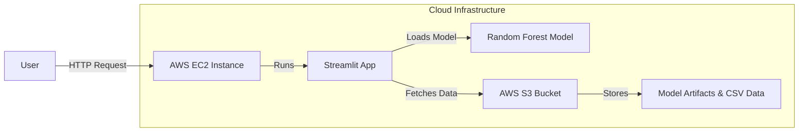

# 🏠 Singapore HDB Resale Price Prediction

> **A Full-Stack Machine Learning Application deployed on AWS to predict housing prices in Singapore.**


## 📌 Project Overview

This project is an end-to-end Machine Learning web application designed to predict the resale prices of Housing and Development Board (HDB) flats in Singapore. 

It demonstrates a complete MLOps lifecycle: from data preprocessing and model training to cloud deployment. The application allows users to input property details and receive real-time price predictions based on historical transaction data.

## 🏗️ Technical Architecture

The application is architected for the cloud, separating compute (EC2) from storage (S3) for scalability.



## 🛠️ Technologies Used

### **Machine Learning & Data Science**
*   **Scikit-Learn (Sklearn)**: core framework for model training and inference.
*   **Algorithm**: **Random Forest Regressor** chosen for its robustness and ability to handle non-linear relationships in housing data.
*   **Pandas & NumPy**: High-performance data manipulation and preprocessing.
*   **Joblib**: Efficient serialization of model pipelines.

### **Cloud Infrastructure (AWS)**
*   **AWS EC2**: Hosts the application on an Ubuntu server using systemd for process management.
*   **AWS S3**: Acts as the centralized storage for the dataset (`housing_data.csv`) and trained model artifacts (`.pkl` files), ensuring specific versions of the model can be updated without redeploying the code.
*   **Boto3**: Python SDK used to programmatically interact with S3 buckets.

### **Web Development & Visualization**
*   **Streamlit**: Rapid development of the interactive web interface.
*   **Plotly & Seaborn**: Generates interactive market analytics charts (heatmaps, trends, price distributions).

## 📊 Key Features

1.  **Real-Time Price Prediction**: enter flat details (town, floor area, storey, etc.) to get an instant valuation.
2.  **Interactive Dashboard**: Explore market trends, compare town prices, and analyze distribution metrics.
3.  **Automated Pipeline**: The app dynamically loads the latest model and data from S3 upon startup.
4.  **Feature Engineering**: Custom transformations for "Remaining Lease", "Town Tiers", and "Storey Ranges" to improve model accuracy.

## 🚀 Getting Started

### Prerequisites
*   Python 3.8+
*   AWS Credentials (if running with S3 integration)

### Installation

1.  **Clone the repository**
    ```bash
    git clone https://github.com/AKASHSOMAN/singapore-hdb-price-random-forest.git
    cd singapore-hdb-price-random-forest
    ```

2.  **Install Dependencies**
    ```bash
    pip install -r requirements.txt
    ```

3.  **Run Locally**
    ```bash
    streamlit run singapore_hdb_app.py
    ```

## 🧠 Machine Learning Model Details

*   **Model**: Random Forest Regressor
*   **Features**: Town, Flat Type, Floor Area (sqm), Storey Range, Lease Commence Date, Transaction Year/Month.
*   **Performance**: The model is evaluated using R² (Coefficient of Determination) and RMSE (Root Mean Squared Error) to ensure accurate price estimation.

## 📄 License
This project is open-source and available for educational and portfolio purposes.
